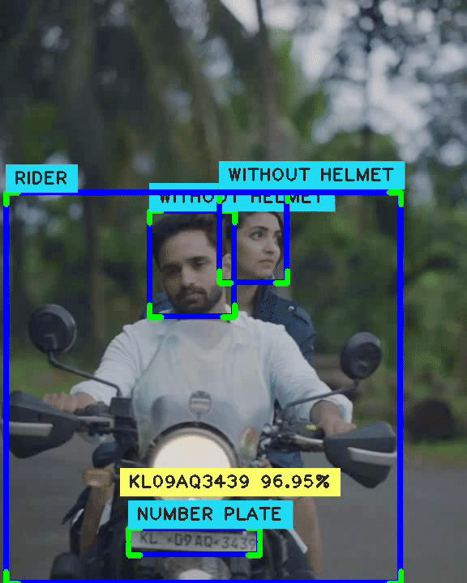

# Detection of Helmet Violations and Capturing Number Plates

## Introduction

The real-time detection of helmet violations and capturing bike numbers from number plates is a comprehensive project that aims to enhance road safety by addressing two critical aspects:

1. **Helmet Violation Detection**: This component of the project focuses on identifying motorcycle riders who are not wearing helmets. It uses computer vision techniques to analyze real-time camera feeds and instantly alerts authorities when a violation is detected.

2. **Capturing Bike Numbers**: The second component involves recognizing number plates and extracting number plate information from vehicles in real-time. This feature is valuable for law enforcement.

## Table of Contents

- [Helmet Violation Detection](#helmet-violation-detection)
- [Number plate Recognition](#number-plate-recognition)
- [Dataset](#dataset)
## Helmet Violation Detection

The helmet violation detection module uses deep learning and computer vision techniques to:

- Detect riders on two-wheelers.

- Determine whether the rider is wearing a helmet.

- Trigger alerts or record instances when a violation is detected.

We used the YOLO (You Only Look Once) model, a pre-trained object detection model, and fine-tuned it using our custom dataset to detect four classes:

- Helmet
- No Helmet
- Rider
- No Rider

## Number plate Recognition

The number plate recognition module uses Optical Character Recognition (OCR) to:

- Detect number plates from motorcycles.

- Extract and recognize alphanumeric text.

- Display the number plate information in real time for further processing.

This helps in identifying riders who violate helmet rules and linking them to their vehicle registration details.

## Dataset
-Acquired a comprehensive dataset from online sources containing 120 images with complete rider information, including the rider, helmet presence, and visible number plate and annotated it.

- [Dataset 1](https://www.kaggle.com/datasets/aneesarom/rider-with-helmet-without-helmet-number-plate/data)  
- [Dataset 2](https://universe.roboflow.com/label-bq9bf/helmet-and-number-plate-tpxed/browse)  
- [Dataset 3](https://universe.roboflow.com/helmet-and-number-plate-detection-fkooz/helmet-and-number-plate-fwans)

During training, YOLO generates a runs/ folder that stores all training logs and weights.
The best model is saved as: **`runs/detect/train/weights/best.pt`**
-This best.pt file is later used in detection to identify helmet violations and number plates.
## Archietecture Used

- YOLOv8 – Used for helmet and rider detection.
- PaddleOCR – Used for number plate text extraction.

### If you find this project useful, kindly give it a star! ⭐️

## Usage
- Run training.py to train the YOLO model on your dataset.
- Once training is completed, update the path of best.pt in main.py.
- Run main.py to perform detection and number plate extraction.

## Demo of Current Status

- A demo video has been saved in the Output Folder.

